# Retail Superstore Sales Analytics — Power BI (CDAP Capstone)

**Author:** Diaa Aldein Alsayed Ibrahim Osman | [LinkedIn](http://www.linkedin.com/in/diaa-ibrahim-31381656)
**Program:** Certified Data Analyst Professional (CDAP) — Epsilon AI Institute — *Capstone project, highest score in cohort*

## Overview
A 14-page storytelling dashboard (~400 visuals) analyzing a retail superstore dataset end-to-end — covering **every required module and every bonus module** in the capstone brief:

| # | Page | Key techniques |
|---|------|----------------|
| 1 | Descriptive Statistics | Statistical KPI cards (mean, median, mode, STD) |
| 2 | Time-Series Analysis | SPLY comparisons, growth rates (DAX time intelligence) |
| 3 | Product Analysis | Top sellers, margins, discount exposure |
| 4 | Category / Sub-Category | Per-category sales & LY comparisons |
| 5 | Discount Analysis | Discount rate distribution, impact on sales & profit |
| 6 | Profitability Analysis | Profit margin by product / category |
| 7 | Quantity Analysis | Trends + correlation scatter (quantity vs. profit/discount) |
| 8 | Order Analysis | Average ticket size, order value distribution |
| 9 | Customer Analysis *(bonus)* | **CLV, churn rate, retention rate, customer lifespan** |
| 10 | Geographic Analysis | Map + decomposition tree (country → city root-cause) |
| 11 | Inventory Analysis *(bonus)* | **Inventory turnover rate**, slow-mover identification |
| 12 | Forecasting *(bonus)* | Time-series forecasts for sales & profit |
| 13 | Cost Analysis | COGS, cost-vs-profit scatter |
| 14 | Market Basket *(bonus)* | Product associations via disconnected table pattern |

## Dashboard Pages

| | |
|---|---|
| 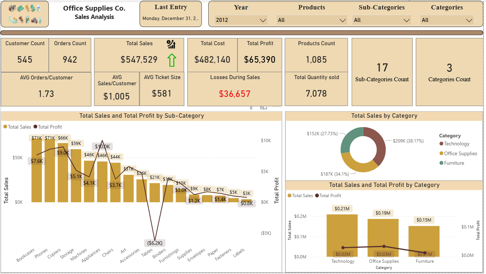 **1. Descriptive Statistics** | 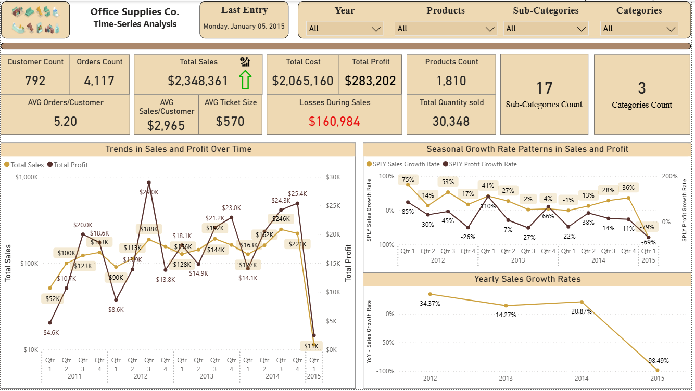 **2. Time-Series Analysis** |
| 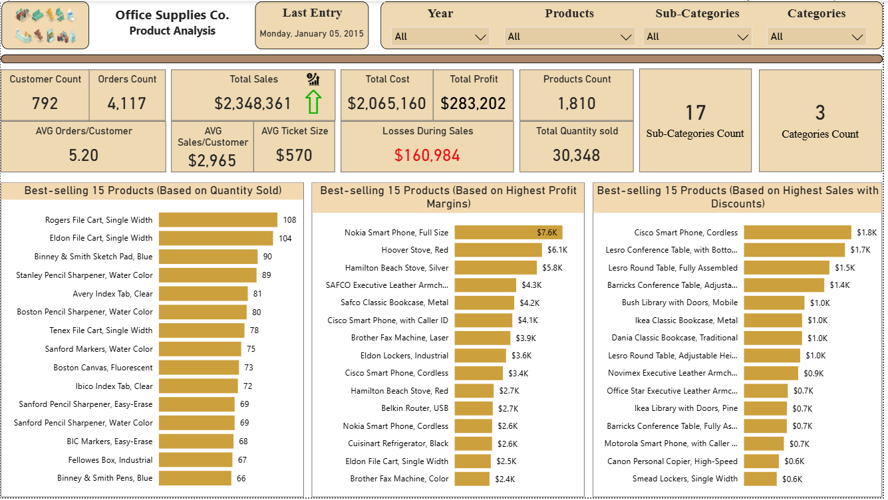 **3. Product Analysis** | 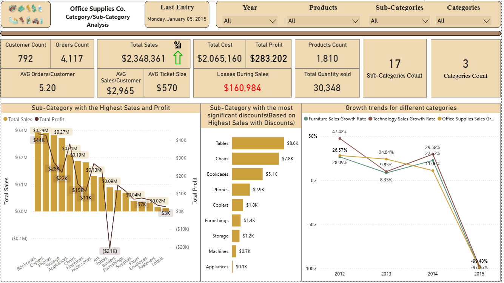 **4. Category / Sub-Category** |
| 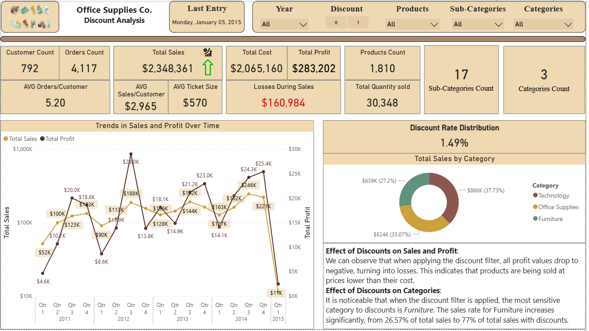 **5. Discount Analysis** | 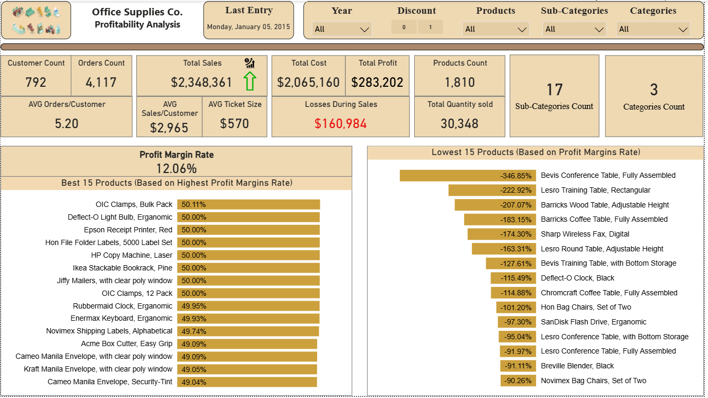 **6. Profitability Analysis** |
| 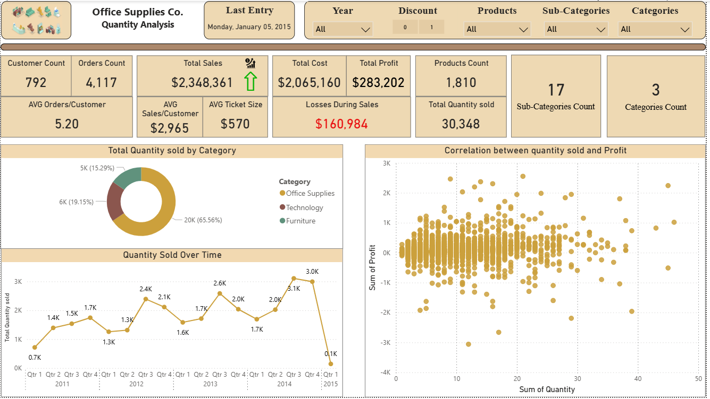 **7. Quantity Analysis** | 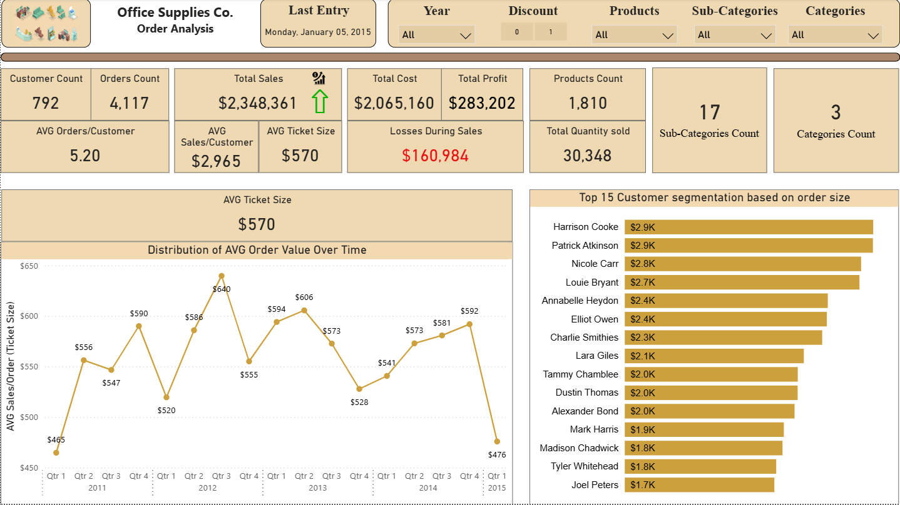 **8. Order Analysis** |
| 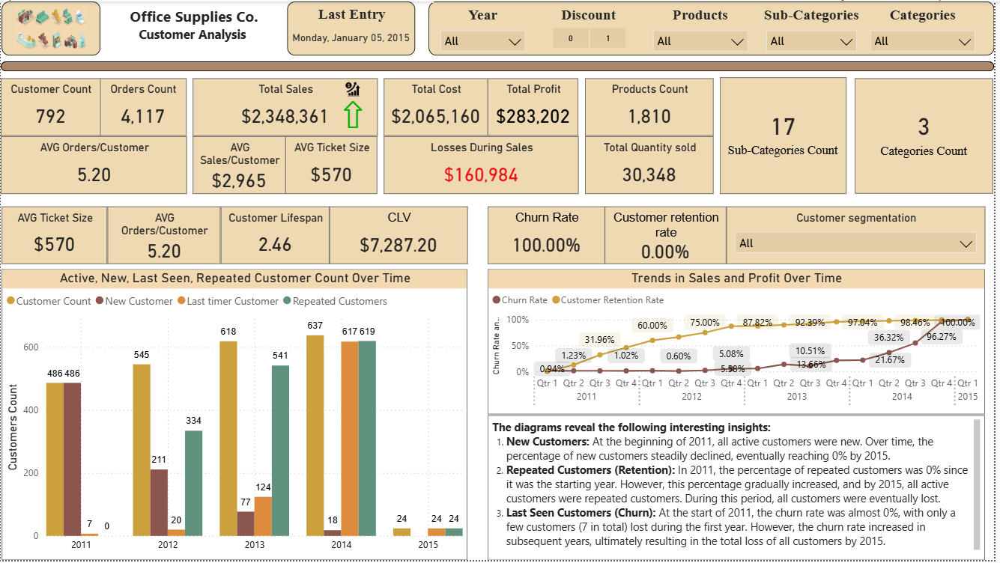 **9. Customer Analysis (Bonus)** | 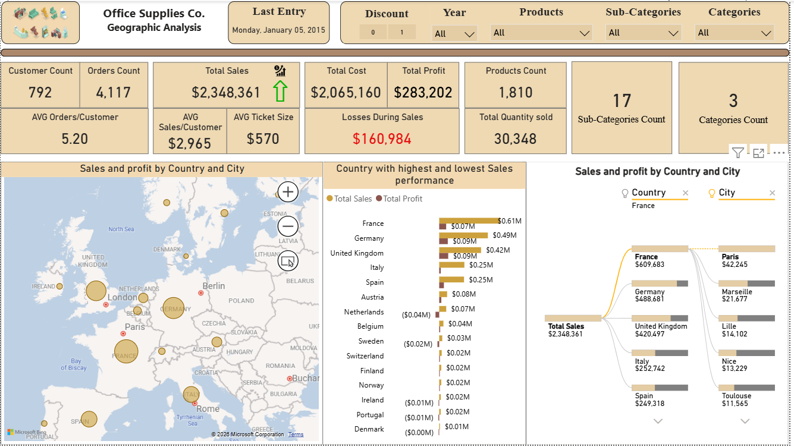 **10. Geographic Analysis** |
| 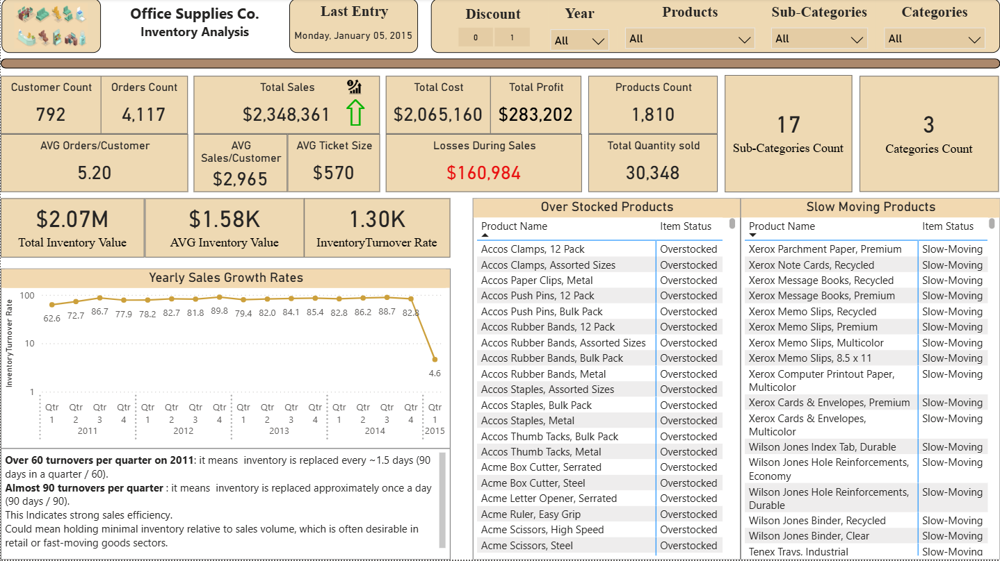 **11. Inventory Analysis (Bonus)** | 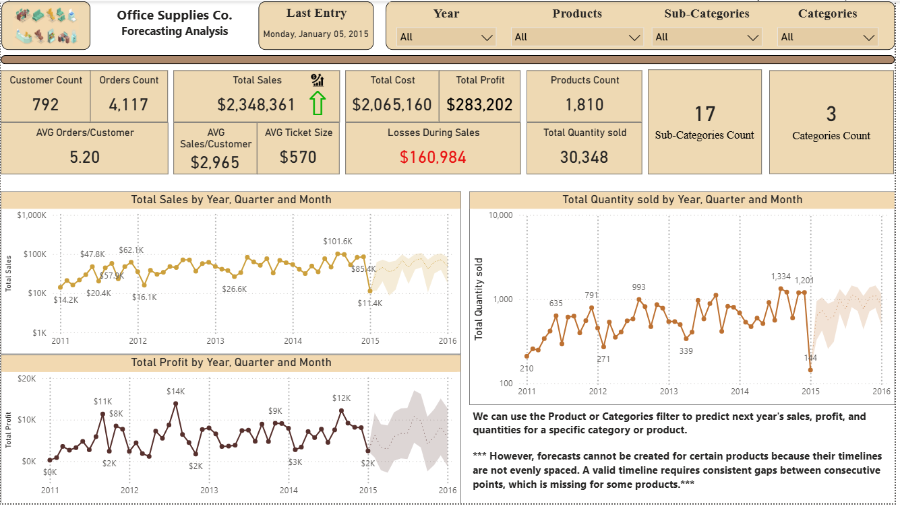 **12. Forecasting (Bonus)** |
| 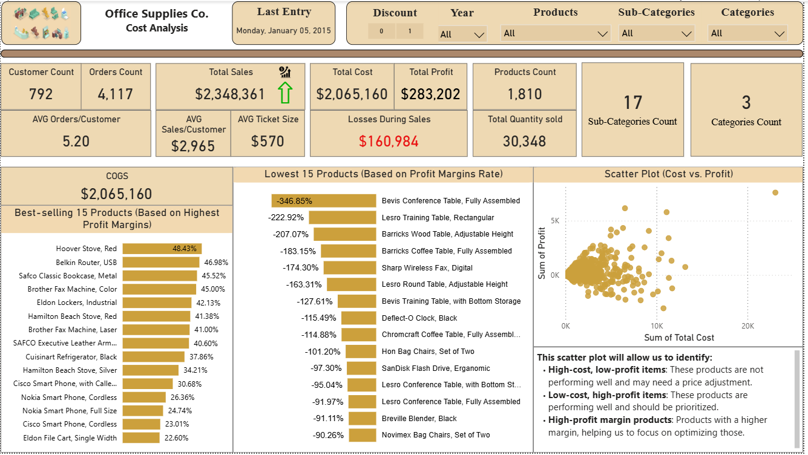 **13. Cost Analysis** | 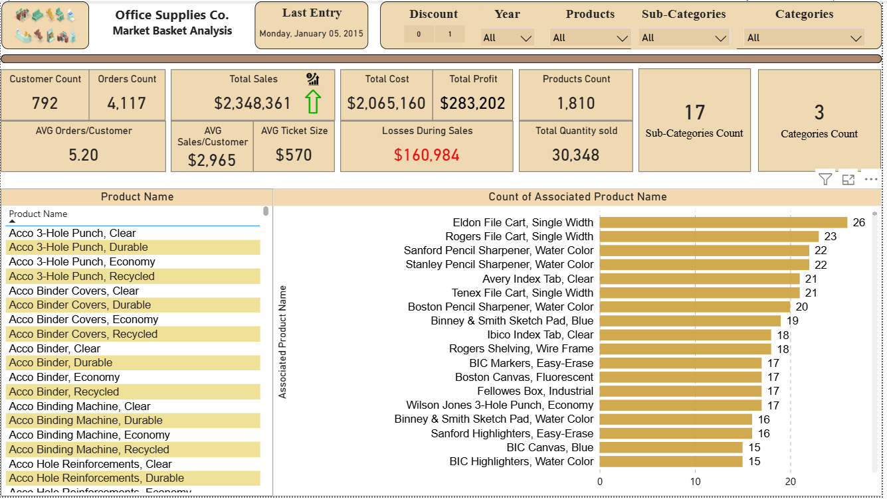 **14. Market Basket (Bonus)** |

**Data cleaning documentation:**

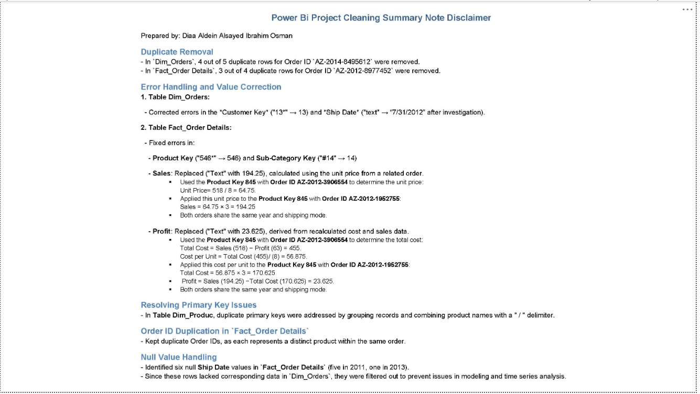

## Data Model
Star schema: `Fact_Order Details` + 9 dimensions (Date, Product, Category, Sub-Category, Customer, Customer Profile, Orders, City, Country) + dedicated `_Key Measure` table with **35+ DAX measures**.

## Data Cleaning (documented in full disclaimer)
- Removed exact duplicates in `Dim_Orders` and `Fact_Order Details`
- Repaired corrupted keys (`"13*"→13`, `"546*"→546`, `"#14"→14`) and text-typed dates
- **Reconstructed missing Sales (194.25) and Profit (23.625) values** from the unit economics of a comparable order (same product, year, ship mode)
- Resolved duplicate primary keys and filtered unmatchable null ship dates

> See the Cleaning Summary Disclaimer PDF for the full decision log.

## Files
- `Diaa_Aldein_Alsayed_Ibrahim_Power_Bi_Project.pbix` — the report
- `Diaa Aldein Power Bi Project Cleaning Summary Notes Disclaimer.pdf` — cleaning decision log
- `/PowerBI_Capstone_Screenshots` — one image per page
